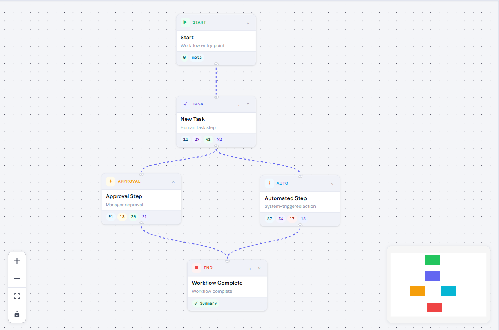
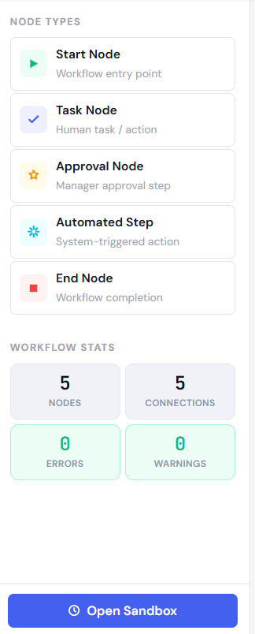
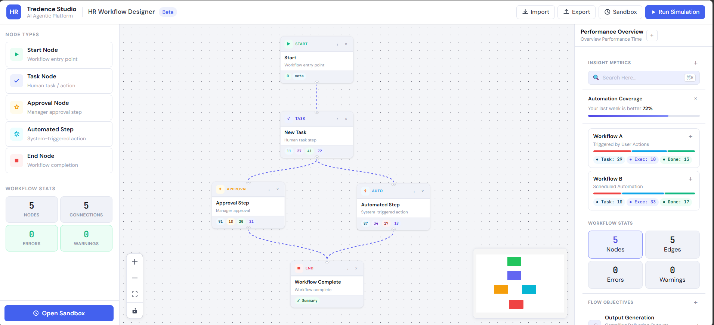
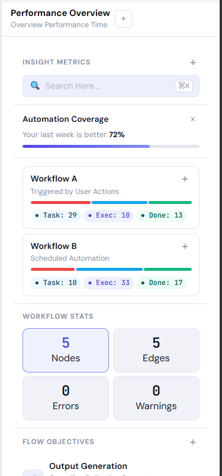
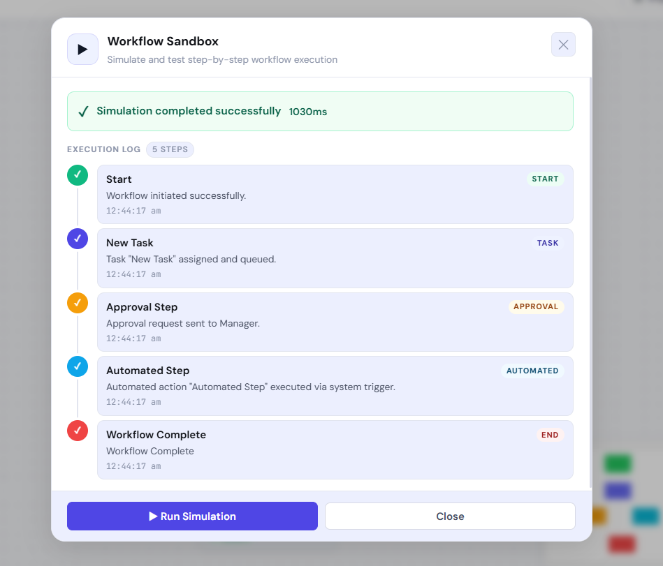

# HR Workflow Designer

> A visual, drag-and-drop HR workflow builder built for the Tredence Analytics Full-Stack Engineering Intern assessment.

    

---

## Table of Contents

- [Quick Start](#quick-start)
- [Features](#features)
- [Architecture](#architecture)
- [Folder Structure](#folder-structure)
- [Node Types & Forms](#node-types--forms)
- [Mock API Layer](#mock-api-layer)
- [Workflow Simulation](#workflow-simulation)
- [Design Decisions](#design-decisions)
- [Assumptions](#assumptions)
- [What I'd Add With More Time](#what-id-add-with-more-time)

---
## UI Preview

### Workflow Canvas


### Node Types


### Overview Panel


### Performance Panel


### Simulation Sandbox


## Quick Start

### Prerequisites
- **Node.js** >= 18
- **npm** >= 9

### Install & Run

```bash
# 1. Clone / unzip the project
cd hr-workflow-designer

# 2. Install dependencies
npm install

# 3. Start development server
npm run dev
# → Opens at http://localhost:5173
```

### Production Build

```bash
npm run build    # TypeScript + Vite build
npm run preview  # Serve the built output
```

---

## Features

| Feature | Status |
|---------|--------|
| Drag-and-drop canvas (React Flow) | ✅ |
| 5 custom node types | ✅ |
| Per-node configuration forms | ✅ |
| Dynamic action parameters (Automated node) | ✅ |
| Key-value pair editor (Start, Task nodes) | ✅ |
| Mock API — `GET /automations` | ✅ |
| Mock API — `POST /simulate` (BFS execution) | ✅ |
| Sandbox modal with step-by-step timeline log | ✅ |
| Workflow validation (structure + cycle detection) | ✅ |
| Export workflow as JSON | ✅ |
| Import workflow from JSON file | ✅ |
| MiniMap + Zoom Controls | ✅ |
| Node template presets (Onboarding, Leave, Doc Verify) | ✅ |
| Real-time stats panel | ✅ |
| Performance Overview right panel | ✅ |
| Delete nodes/edges (click × or press Delete key) | ✅ |

---

## Architecture

```
┌──────────────────────────────────────────────────────────────┐
│                        App Shell                             │
│  ┌──────────┐  ┌─────────────────────────┐  ┌────────────┐  │
│  │  Nav     │  │      Main Area          │  │   Config   │  │
│  │ Sidebar  │  │  ┌──────────────────┐   │  │   Panel    │  │
│  │          │  │  │    Topbar        │   │  │            │  │
│  │ General  │  │  └──────────────────┘   │  │ Perf.      │  │
│  │ Auto     │  │  ┌───────┐ ┌────────┐   │  │ Overview   │  │
│  │ Resources│  │  │Palette│ │ Canvas │   │  │            │  │
│  │          │  │  │ Panel │ │(ReactF)│   │  │ Node Form  │  │
│  │ Settings │  │  └───────┘ └────────┘   │  │ (dynamic)  │  │
│  └──────────┘  └─────────────────────────┘  └────────────┘  │
└──────────────────────────────────────────────────────────────┘
                              │
               ┌──────────────▼──────────────┐
               │      Zustand Store           │
               │  nodes · edges · selected    │
               │  simulationResult · errors   │
               └─────────────┬───────────────┘
                             │
               ┌─────────────▼───────────────┐
               │       Mock API Layer         │
               │  GET /automations            │
               │  POST /simulate (BFS)        │
               └─────────────────────────────┘
```

### Data Flow

1. **User drags** a node type from the Palette Panel onto the React Flow canvas → `addNode()` in Zustand store
2. **User clicks** a node → `setSelectedNodeId()` → Config Panel renders the correct form
3. **Form changes** call `updateNodeData()` → Zustand mutates nodes in-place → node card re-renders
4. **Run Simulation** → `validateWorkflow()` checks structure → `apiClient.simulate()` runs BFS traversal → result stored in Zustand → Sandbox modal displays timeline
5. **Export** serializes `{ nodes, edges }` to JSON and triggers browser download

---

## Folder Structure

```
src/
├── api/
│   └── client.ts              # Mock API — getAutomations(), simulate()
│
├── components/
│   ├── Canvas/
│   │   └── Canvas.tsx         # ReactFlow canvas, drag-and-drop, MiniMap, Controls
│   │
│   ├── Forms/
│   │   ├── KeyValueEditor.tsx # Reusable key-value pair editor component
│   │   ├── NodeForms.tsx      # One form per node type (StartNodeForm, TaskNodeForm…)
│   │   └── NodeConfigPanel.tsx # Right panel: dispatches form or shows overview
│   │
│   ├── Layout/
│   │   ├── NavSidebar.tsx     # Left navigation sidebar (matching reference UI)
│   │   └── Topbar.tsx         # Top bar with title, undo/redo, action buttons
│   │
│   ├── Nodes/
│   │   └── index.tsx          # All 5 node display components + nodeTypes registry
│   │
│   ├── Sandbox/
│   │   └── SandboxPanel.tsx   # Simulation modal with timeline execution log
│   │
│   └── Sidebar/
│       └── PalettePanel.tsx   # Draggable node palette + template presets
│
├── hooks/
│   ├── useAutomations.ts      # Fetches GET /automations, returns { automations, loading }
│   └── useSimulation.ts       # Orchestrates validate → simulate → store result
│
├── store/
│   └── workflowStore.ts       # Zustand store — single source of truth
│
├── types/
│   └── index.ts               # All TypeScript interfaces (node data shapes, API types)
│
├── utils/
│   └── validation.ts          # Graph validation: missing nodes, disconnected, cycles (DFS)
│
├── App.tsx                    # Root layout: NavSidebar + Topbar + Workspace
├── main.tsx                   # React entry point
└── styles.css                 # Full design system CSS (light theme, Inter font)
```

---

## Node Types & Forms

### Start Node
Entry point of the workflow. Only one allowed per workflow.

| Field | Type | Required |
|-------|------|----------|
| Start Title | text | ✅ |
| Metadata | key-value pairs | No |

### Task Node
Human task step (collect documents, fill forms, etc.)

| Field | Type | Required |
|-------|------|----------|
| Title | text | ✅ |
| Description | textarea | No |
| Assignee | text | No |
| Due Date | date picker | No |
| Custom Fields | key-value pairs | No |

### Approval Node
Manager / HR approval gate.

| Field | Type | Required |
|-------|------|----------|
| Title | text | ✅ |
| Approver Role | select (Manager, HRBP, Director, VP, C-Suite) | No |
| Auto-Approve Threshold % | number 0–100 | No |

### Automated Step Node
System-triggered actions fetched from the mock API.

| Field | Type | Required |
|-------|------|----------|
| Title | text | ✅ |
| Action | select (from `GET /automations`) | No |
| Action Parameters | dynamic inputs per action | No |

### End Node
Workflow completion marker. Only one required per workflow.

| Field | Type | Required |
|-------|------|----------|
| End Message | text | No |
| Show Summary Report | toggle | No |

---

## Mock API Layer

**File:** `src/api/client.ts`

All API calls simulate network latency with `setTimeout`. The `apiClient` object is the only place that makes "requests" — replacing with a real backend only requires changing this file.

### `GET /automations`

```typescript
const automations = await apiClient.getAutomations();
// Returns:
[
  { id: "send_email",      label: "Send Email",           params: ["to", "subject"] },
  { id: "generate_doc",   label: "Generate Document",    params: ["template", "recipient"] },
  { id: "send_slack",     label: "Send Slack Notification", params: ["channel", "message"] },
  { id: "create_ticket",  label: "Create JIRA Ticket",   params: ["project", "summary"] },
  { id: "update_hris",    label: "Update HRIS Record",   params: ["employeeId", "field", "value"] },
  { id: "schedule_meeting", label: "Schedule Meeting",   params: ["attendees", "duration"] },
]
```

### `POST /simulate`

```typescript
const result = await apiClient.simulate(nodes, edges);
// Returns:
{
  success: true,
  steps: [
    {
      nodeId: "uuid",
      nodeType: "task",
      title: "Collect Documents",
      status: "success",
      message: "Task assigned and queued.",
      timestamp: "2024-01-15T10:30:00.000Z"
    },
    // ... one entry per node, in BFS traversal order
  ],
  errors: [],
  duration: 1240  // ms
}
```

The simulate function:
1. Validates structure (start/end nodes, connections)
2. Builds adjacency map from edges
3. BFS-traverses from Start node
4. Returns ordered execution log

---

## Workflow Simulation

The **Sandbox Panel** (modal) shows:

- **Validation errors** before simulation (missing Start/End, disconnected nodes, cycles)
- **Loading state** while simulation runs
- **Result banner** — green for pass, red for fail
- **Timeline log** — animated step-by-step cards, one per node, in execution order

### Validation Rules

| Rule | Severity |
|------|----------|
| No Start node | Error |
| Multiple Start nodes | Error |
| No End node | Error |
| Disconnected node (no edges) | Warning |
| Cycle detected (DFS) | Error |

---

## Design Decisions

### State Management — Zustand
Chosen over Context + useReducer for three reasons:
1. **No boilerplate** — no actions, reducers, or providers
2. **Direct selector access** — components subscribe to only what they need
3. **Flat store** — the entire workflow graph, UI state, and simulation result live in one predictable object

### React Flow
Used for the canvas layer. Custom node types are registered via the `nodeTypes` map. `screenToFlowPosition()` converts browser coordinates to canvas coordinates on drop.

### Form Architecture (Discriminated Union Pattern)
`NodeConfigPanel` reads `node.type` and renders the corresponding form. Adding a new node type requires:
1. Add interface to `types/index.ts`
2. Add display component to `Nodes/index.tsx`
3. Add form to `NodeForms.tsx`
4. Register in `nodeTypes` map

No other files change. The pattern scales to N node types.

### Mock API Abstraction
`apiClient` is a plain object with async methods. The rest of the app treats it as a real API. Swapping to a real backend = change 1 file, 0 component changes.

### CSS Architecture
Single `styles.css` with CSS custom properties (variables). No CSS-in-JS, no Tailwind. All theming is centralized in `:root {}` — changing the entire color scheme = change ~20 variables.

---

## Assumptions

1. **No authentication** — as stated in the spec, no login/session required
2. **No backend persistence** — workflow lives in Zustand (in-memory); refresh clears state (export JSON to save)
3. **Single Start node** — treated as a hard validation error per spec
4. **Directed acyclic graph** — cycles are invalid; the DFS cycle detector enforces this
5. **Metric chips on nodes** — static display values shown to match the reference UI; in a real product these would come from a metrics API
6. **Template presets** — load a fresh workflow, replacing any existing one (no merge/append)

---

## Tech Stack

| Layer | Technology |
|-------|------------|
| Framework | React 18 + TypeScript 5 |
| Build | Vite 5 |
| Canvas | React Flow 11 |
| State | Zustand 4 |
| Styling | CSS custom properties (no framework) |
| Font | Inter + JetBrains Mono (Google Fonts) |
| Mock API | In-memory async functions (no MSW/json-server) |
| IDs | uuid v4 |

---
